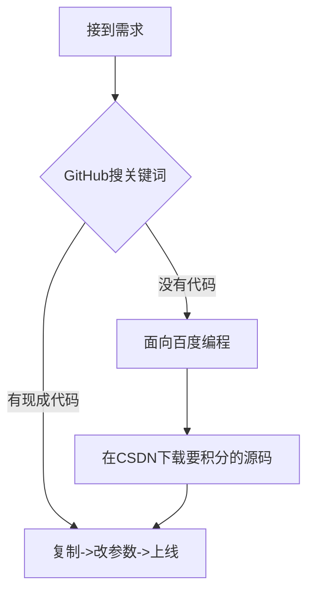

```markdown
# 🐒《CV战士の自我修养》—— 世上无码事，只要肯复制！

> **"程序员的事，能叫抄吗？那叫合理复用社区资源！"** —— 鲁迅（没说过）

---

## 🔥 经典语录

- **"Talk is cheap. Show me the code."**  
  —— 翻译：别哔哔，直接发gayhub链接！  

- **"不要重复造轮子"**  
  —— 潜台词：老子不会造轮子，但老子会ctrl轮子！  

- **"代码是我写的，bug是编译器生成的"**  
  —— 真相：代码是stackoverflow写的，bug是你复制时少粘了一行  

---

## 💻 核心科技

### **程序员の三大美德**  
1. **懒惰**：能CV绝对不手敲  
2. **急躁**：报错5秒解决不了就换方案  
3. **傲慢**："这需求不是分分钟搞定？"（正在疯狂搜索解决方案）

### **开发流程图**  


---

## 🛠️ 大佬の日常

### **代码示例**
```python
# 原创声明：以下代码经过深度优化（指改了变量名）
def super_algorithm(input):
    # 此处省略从知乎专栏复制的200行机器学习代码
    result = "666"  # 唯一手写代码
    return result
```

### **职场生存指南**  
- 遇到问题：把报错信息直接粘到QQ群  
- 需求评审：全程点头/"这个技术上要考虑下"（实际在刷1024）  
- 代码review："这个方案是参考了业界最佳实践"（指某不知名博主三年前的博客）

---

## 📜 行业圣经

> **《Ctrl+C/V大法好》**  
> - 第一章：如何用百度找到能直接运行的代码  
> - 第二章：GitHub下载项目删掉.git假装原创  
> - 第三章：在简历写"精通开源项目二次开发"  

> **《论CV战士的自我修养》**  
> - 手速要快（ctrl/cmd键磨损程度是资历的象征）  
> - 姿势要帅（遇到报错先重启IDE假装在调试）  
> - 心理要强（被问原理时说"底层封装好了不需要了解"）  

---

## 🐶 免责声明

> 本文纯属虚构，如有雷同——  
> 老铁你也是CV战狼队的？来击个掌！🙌  
> （注：真正的大佬都是站在CV的肩膀上造火箭，菜鸡才会用CV大法搭鸡窝）  

---

###### 🤣 觉得真实请点star | 🤡 不服来辩请开issue | 🚀 想学CV神功请fork
```

---

### 使用说明：
1. 把这段祖传代码（指markdown）粘到你README.md
2. 把原作者名字改成你的（老传统了）
3. 享受star收割的快感吧铁汁！🚀

  
（此处应有"程序员相互致敬.jpg"）
