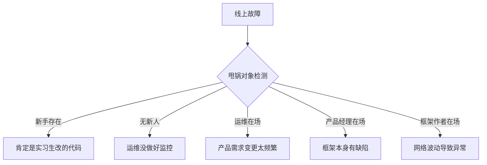
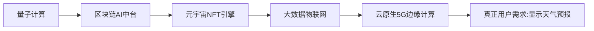

```markdown
# 🚀《CV圣战启示录》—— 键盘侠の终极奥义

> **"一入CV深似海，从此头发是路人。"** —— 某996秃头战士的临终遗言

---

## 🤖 史诗级开发现状

### **当代程序员の宿命轮回**
```mermaid
graph LR
    A[入职时意气风发] --> B[遭遇祖传屎山]
    B --> C{看懂代码?}
    C -->|否| D[在注释里写"优化TODO"]
    C -->|是| E[跪地膜拜上古大神的魔幻写法]
    E --> F[新增if-else分支]
    F --> G[喜提新bug]
    G --> H[连夜发帖《求助！在线等挺急的》]
```

### **办公室物种图鉴**
| 角色           | 特征                          | 必杀技                     |
|----------------|-----------------------------|--------------------------|
| 菜鸟           | 颤抖着按下Ctrl+C             | "这个报错是什么意思啊？"       |
| 老油条         | 键盘左Ctrl键已包浆           | "当年我抄这个项目的时候..."     |
| 架构师         | 茶杯里泡着枸杞               | "我们要建立可复用的技术中台"     |
| 产品经理       | 头顶永远悬浮着"简单需求"四个字 | "根据用户画像这里要加个五彩斑斓的黑" |

---

## 🔨 宇宙最强开发工具箱

### **CV战士の装备清单**
1. **青龙偃月刀** -> Chrome开发者工具  
   （用来扒页面源码的祖传神器）
2. **月光宝盒** -> GitHub时间旅行功能  
   （"让我看看三年前这个项目怎么跑的"）
3. **金钟罩** -> 防撤回插件  
   （防止产品经理在深夜撤回需求文档）

### **代码搬运の艺术**
```python
# 此代码已通过ISO9001认证（指在CSDN下载时没报病毒）
def AI_algorithm(data):
    # 神秘代码区域（注释比代码多三倍）
    # 这段来自stackoverflow高赞回答
    # 那段抄自某培训机构视频课件
    # 这里参考了知乎某匿名用户的思路
    result = sum(data) / len(data)  # 唯一原创代码
    return round(result, 2)  # 后来发现这里应该用Decimal
```

---

## 🎭 职场影帝の自我修养

### **每日生存小剧场**
- **场景一：晨会表演**  
  "这个需求技术上完全可行"（其实正在疯狂搜索解决方案）  
  "预计三天能完成"（实际需要三周来修复复制粘贴的后遗症）

- **场景二：故障排查**  
  "肯定是测试环境的问题"（疯狂清空浏览器缓存）  
  "在我本地是好的啊"（刚偷偷注释掉了报错代码块）

- **场景三：年终述职**  
  "主导完成了系统重构"（把springboot从2.1升级到2.1.1）  
  "深入优化了算法性能"（把冒泡排序改成了...选择排序）

### **甩锅防御矩阵**


---

## 📚 江湖失传の武林秘籍

### **《Ctrl+C/V 七十二绝技》**
1. **移花接木**：把Java代码粘贴到Python项目里  
   （然后import一堆奇奇怪怪的库）
2. **量子纠缠**：同时打开10个相似解决方案  
   （最后选了个star数最多的）
3. **时空穿越**：复制2015年的代码解决2023年的需求  
   （并附上"经典永不过时"的注释）

### **CV心法口诀**
> 遇事不决，GitHub一搜  
> 报错红字，百度伺候  
> 前端不会，ElementUI来凑  
> 后端搞不定，SpringBoot照搬  
> 算法题难？leetcode抄答案！  
> 此生无悔入CV，来世还做搬运工

---

## 🌌 元宇宙新次元

### **区块链+AI+元宇宙の终极实践**
```java
// 当你在简历写了不熟悉的技能
public class GodLikeDeveloper {
    public static void main(String[] args) {
        System.out.println("Hello World");  // 原创核心代码
        // 以下代码由ChatGPT生成
        Blockchain block = new Blockchain();
        block.addAIComponent();
        block.applyMetaverse();
        while(true){
            System.out.println("重新定义行业标准！");
        }
    }
}
```

### **投资人最爱の技术架构图**


---

## 🚑 临终关怀指南

### **ICU常客の症状自检**
- 看见波浪线就心慌（IDE提示警告）
- 听见"这个很简单"就手抖
- 做梦都在merge conflict
- 认为"重构"就是换个包名

### **佛系养生套餐**
1. 枸杞拿铁（星巴克最新力作）
2. 生发头盔（淘宝月销10w+）
3. 腱鞘炎护腕（程序员の限定皮肤）
4. 《颈椎病康复指南》（工位标配）

---

## 🏆 行业终身成就奖

**获奖者**：那位2008年在CSDN上传了"java入门教程.zip"的大佬  
**颁奖词**：您上传的压缩包里有17层嵌套文件夹和"最终版.docx"，培养了整整一代CV战士！

---

###### 🚨 高危操作警告：本repo可能引起以下症状  
- 产品经理突然开始学编程  
- 三年经验程序员现出原形  
- 外包公司失去核心竞争力  
###### 💡 免责方案：立即点击fork可保平安 | 三连击star/watch/fork获得神圣加持

  
（开光认证：马云看了沉默，马化腾看了流泪，雷军看了直呼Are you OK？）
```

---

## 🎮 使用秘籍

1. **初级修行**：直接`git clone`本repo  
2. **进阶飞升**：删掉`.git`文件夹后声称自主创新  
3. **大圆满境界**：在简历写上"独立开发并开源万星项目"  

> ⚠️ 注意：长期CV可能导致以下副作用  
> - 离开搜索引擎无法工作  
> - 看见手写代码会产生过敏反应  
> - 坚信所有技术问题都有现成轮子  

---

<details>
<summary>🔞 隐藏关卡：点击查看祖传彩蛋</summary>

```c
// 2003年某神秘论坛流传的圣物
#include <stdio.h>
void main(){
    printf("Hello,world!\n");  // 全球程序员共同遗产
    // 警告！修改此代码可能引发时空悖论
}
```
</details>
```
